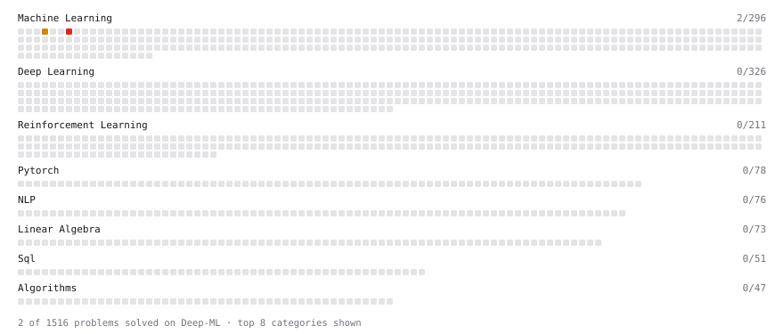

# Deep-ML

My machine learning practice from [Deep-ML](https://www.deep-ml.com). Every solution here was written by hand.

**3** solved · 2 problems · 1 labs · 0 math

[**Browse the interactive portfolio**](https://Maahi17yr.github.io/deep-ml/) to replay this filling in over time.

## Problems

| | Difficulty | Solved | |
| --- | --- | --- | --- |
| [K-Means Clustering](https://www.deep-ml.com/problems/17) | medium | 2026-10-09 | [solution](problems/0017-k-means-clustering) |
| [Decision Tree Learning](https://www.deep-ml.com/problems/20) | hard | 2026-10-09 | [solution](problems/0020-decision-tree-learning) |

## Labs

| | Difficulty | Solved | |
| --- | --- | --- | --- |
| [Train a Linear Regression Model](https://www.deep-ml.com/labs/18) | easy | 2026-10-09 | [solution](labs/0018-train-a-linear-regression-model) |

---

_This file is regenerated by Deep-ML on every push._
